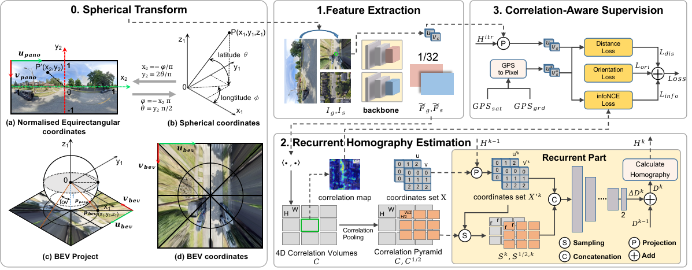

<h1 align="center"><strong>HC-Net: Fine-Grained Cross-View Geo-Localization Using a Correlation-Aware Homography Estimator</strong></h1>

<p align="center">
  <a href="https://arxiv.org/abs/2308.16906" target='_blank'>
    
  </a> 
  <a href="https://arxiv.org/pdf/2308.16906.pdf" target='_blank'>
    
  </a> 
  <a href="http://101.230.144.196:7860/" target='_blank'>
    
  </a>
</p>

##  🏠 About



We introduce a novel approach to fine-grained cross-view geo-localization. Our method **aligns a warped ground image with a corresponding GPS-tagged satellite image covering the same area using homography estimation.** We first employ a differentiable **spherical transform**, adhering to geometric principles, to **accurately align the perspective of the ground image with the satellite map.** This transformation effectively places ground and aerial images in the same view, reducing the task to an image alignment problem. To address challenges such as occlusion, small overlapping range, and seasonal variations, we propose a robust correlation-aware homography estimator to align similar parts of the transformed ground image with the satellite image. Our method achieves **sub-pixel resolution and meter-level GPS accuracy** by mapping the center point of the transformed ground image to the satellite image using a homography matrix and determining the orientation of the ground camera using a point above the central axis. Operating at a speed of 30 FPS, our method outperforms state-of-the-art techniques, **reducing the mean metric localization error by 21.3% and 32.4%** in same-area and cross-area generalization tasks on the VIGOR benchmark, respectively, and by **34.4% on the KITTI benchmark in same-area evaluation.**

## 🔥 News

- [2023-08] We release the [paper](https://arxiv.org/abs/2308.16906) of HC-Net and an online gradio [demo](http://101.230.144.196:7860).

## 🤖 Online Demo

**HC-Net is online! Try it at [this url](http://101.230.144.196:7860/).**

You can test our model using the data from the **'same_area_balanced_test'** split of the [VIGOR](https://github.com/Jeff-Zilence/VIGOR) dataset, or by providing your own Panorama image along with its corresponding Satellite image.


## 🏷️ Label Correction for [VIGOR](https://github.com/Jeff-Zilence/VIGOR) Dataset


We propose the use of [Mercator projection](https://en.wikipedia.org/wiki/Web_Mercator_projection#References) to directly compute the pixel coordinates of ground images on specified satellite images using the GPS information provided in the dataset.

To use our corrected label, you can add the following content to the `__getitem__` method of the `VIGORDataset` class in `datasets.py` file in the [CCVPE](https://github.com/tudelft-iv/CCVPE) project:

```python
from Mercator import *

pano_gps = np.array(self.grd_list[idx][:-5].split(',')[-2:]).astype(float)   
pano_gps = torch.from_numpy(pano_gps).unsqueeze(0) 

sat_gps = np.array(self.sat_list[self.label[idx][pos_index]][:-4].split('_')[-2:]).astype(float)
sat_gps = torch.from_numpy(sat_gps).unsqueeze(0)     

zoom = 20
y = get_pixel_tensor(sat_gps[:,0], sat_gps[:,1], pano_gps[:,0],pano_gps[:,1], zoom) 
col_offset_, row_offset_ = y[0], y[1]

width_raw, height_raw = sat.size
col_offset, row_offset = width_raw/2 -col_offset_.item(), row_offset_.item() - height_raw/2
```

## 📝 TODO List
- [ ] Add data preparation codes.
- [ ] Add inferencing and serving codes with checkpoints.
- [ ] Add evaluation codes.
- [ ] Add training codes.

## 🔗 Citation

If you find our work helpful, please cite:

```bibtex
@article{wang2023finegrained,
      title={Fine-Grained Cross-View Geo-Localization Using a Correlation-Aware Homography Estimator}, 
      author={Xiaolong Wang and Runsen Xu and Zuofan Cui and Zeyu Wan and Yu Zhang},
      journal={arXiv preprint arXiv:2308.16906},
      year={2023}
}
```
